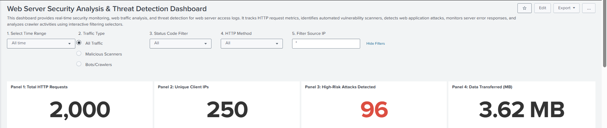
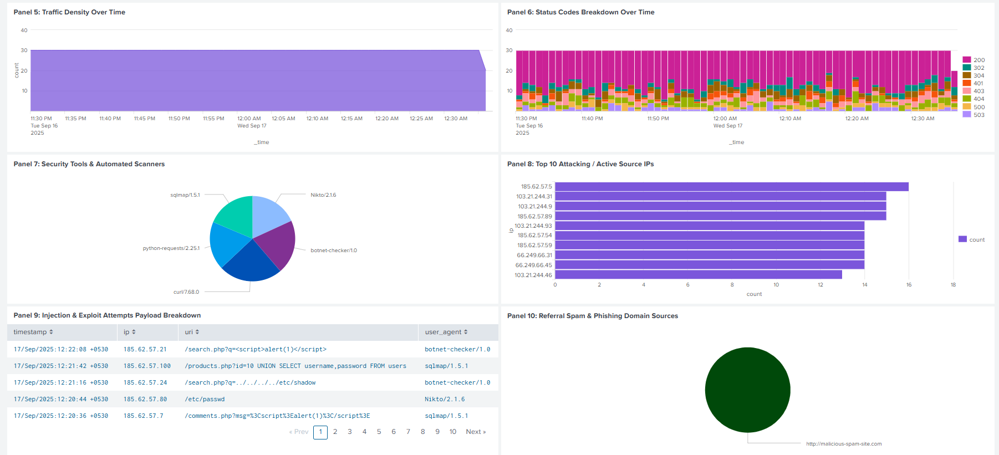
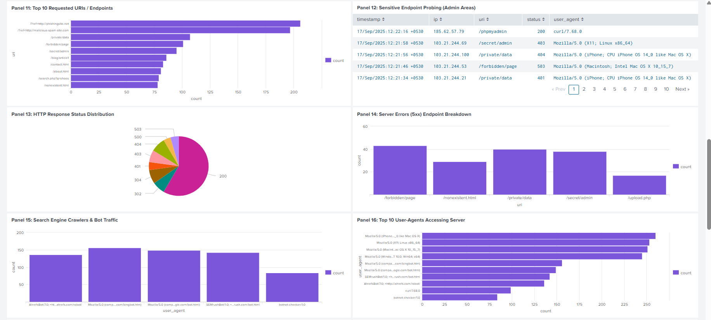
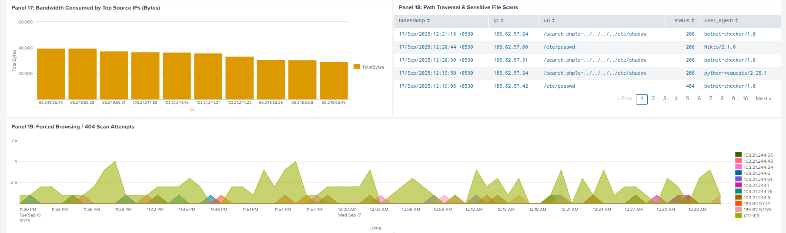
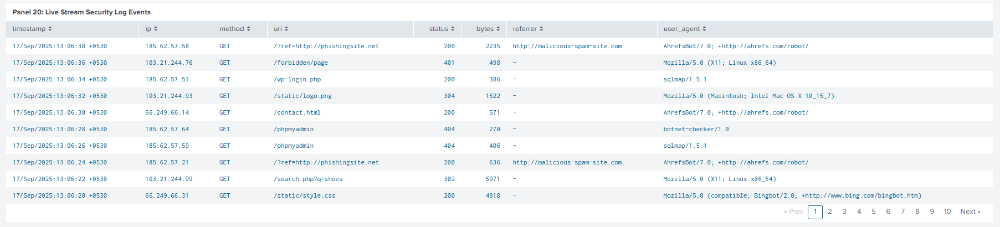

# Web Application Threat Detection & Log Analysis System in Splunk Enterprise

## 1. Executive Summary
This enterprise-grade Security Operations Center (SOC) project implements an end-to-end web threat monitoring, detection, and incident response platform built inside **Splunk Enterprise**. The primary objective is to ingest, parse, correlate, and analyze multi-vector web attack events from raw HTTP/HTTPS web application security logs (`web_security_logs`). 

By leveraging dynamic XML dashboard tokenization and customized Search Processing Language (SPL) queries, this project provides real-time visibility into active intrusion attempts—including SQL Injection (SQLi), Cross-Site Scripting (XSS), Automated Vulnerability Scanning, Path Traversal, Unauthorized Endpoint Probing, and Data Exfiltration. Furthermore, an automated alert framework configured via Splunk's backend configuration (`savedsearches.conf`) ensures proactive threat detection with integrated SOC Playbook response workflows.

---

## 2. System Architecture & Technical Flow

```
[ Web Clients / Attackers ]
          │
          ▼  (HTTP / HTTPS Logs)
[ Custom Web Server Infrastructure ]
          │
          ▼  (JSON / Key-Value Log Ingestion)
[ Splunk Enterprise Indexer & Search Head ]
    ├── Index: index=web_security_logs
    ├── Parsing & Field Extraction
    │
    ├──► Interactive 20-Panel XML Dashboard (Dynamic Tokens)
    └──► Automated Alert Engine (savedsearches.conf Cron Triggers)
          │
          ▼
[ SOC Analyst Triage & Incident Response Playbook ]
```

---

## 3. Dataset Overview & Field Schema

The security event dataset is structured in key-value / JSON formatting ingested under the index `index=web_security_logs`. The log schema maps directly to critical HTTP headers and transaction metrics required for forensic analysis.

### Comprehensive Field Mapping Dictionary

| Field Name | Data Type | Sample Value | Security Description & Analytical Purpose |
| :--- | :--- | :--- | :--- |
| **`_time`** | Timestamp | `2026-08-08 04:15:40` | Precise event time used for time-series correlation and velocity tracking. |
| **`ip`** | String (IPv4) | `192.168.1.105` | Source IPv4 address originating the HTTP request; used for reputation checking & blocking. |
| **`method`** | String | `POST` | HTTP request method (`GET`, `POST`, `PUT`, `DELETE`). High `POST` volume indicates form manipulation or payload delivery. |
| **`uri`** | String | `/login.php?user=' OR '1'='1` | Target URI endpoint including query string parameters; analyzed for payload injection. |
| **`status`** | Integer | `404`, `500`, `200` | HTTP response status code generated by web server; key indicator of attack success vs. failure. |
| **`bytes`** | Numeric | `5420100` | Size of the HTTP response payload in bytes; evaluated for data exfiltration spikes. |
| **`user_agent`** | String | `sqlmap/1.5#stable` | Client browser or tool identification string; used to detect automated security scanners and bots. |
| **`referrer`** | String | `http://malicious-spam.com` | Referring URL header indicating traffic origin; checked for malicious ad/spam networks. |
| **`traffic_type`** | String | `Malicious Scanners` | Synthetic or ML-derived classification label (`Normal`, `SQLi Probes`, `XSS Attempts`, `Scanners`). |

---

## 4. Interactive Dashboard Controls (Dynamic Tokens)

The dashboard utilizes Splunk Simple XML dynamic input tokens to enable interactive filtering across all 20 visualization panels without rewriting SPL queries manually.

* **Status Code Token (`$status_tok$`)**: Dropdown input allowing analysts to isolate specific HTTP response codes (e.g., `200` for successful hits, `404` for missing resources, `500` for server errors, or `*` for all traffic).
* **HTTP Method Token (`$method_tok$`)**: Multi-select control to isolate specific HTTP request verbs (`GET`, `POST`, `PUT`, `DELETE`).
* **Client IP Token (`$ip_tok$`)**: Text input box allowing SOC analysts to filter the entire dashboard by a single suspicious IP address during deep-dive investigations.
* **Traffic Scope Token (`$traffic_scope_tok$`)**: Radio button selector providing instant scoping between All Traffic, Benign/Normal Traffic, and Malicious Traffic subsets.

---

## 5. Comprehensive 20-Panel Dashboard Specifications

Below is the complete breakdown of all 20 dashboard visual panels, including panel titles, technical descriptions, target SPL queries, and image placeholders for visual documentation.

---

### Panel 01: Total Web Log Events
* **Description**: Single-value metric displaying the aggregate count of ingested web security logs within the selected time window and filter criteria.
* **Visual Type**: Single Value Widget
* **SPL Query**:
```spl
index=web_security_logs status="$status_tok$" method="$method_tok$" ip="$ip_tok$" $traffic_scope_tok$ 
| stats count
```

### Panel 02: Unique Client IPs
* **Description**: Single-value metric calculating the distinct count of unique source IP addresses interacting with the web server.
* **Visual Type**: Single Value Widget
* **SPL Query**:
```spl
index=web_security_logs status="$status_tok$" method="$method_tok$" ip="$ip_tok$" $traffic_scope_tok$ 
| stats dc(ip) as unique_clients
```

### Panel 03: Total Data Transferred (MB)
* **Description**: Calculates total network data outbound throughput converted from raw bytes into Megabytes (MB).
* **Visual Type**: Single Value Widget
* **SPL Query**:
```spl
index=web_security_logs status="$status_tok$" method="$method_tok$" ip="$ip_tok$" $traffic_scope_tok$ 
| stats sum(bytes) as total_bytes 
| eval MB = round(total_bytes/1024/1024, 2) 
| fields MB
```

### Panel 04: Overall HTTP Status Code Distribution
* **Description**: Pie chart displaying the proportional breakdown of HTTP status response codes (e.g., 200 OK, 403 Forbidden, 404 Not Found, 500 Internal Error).
* **Visual Type**: Pie Chart
* **SPL Query**:
```spl
index=web_security_logs status="$status_tok$" method="$method_tok$" ip="$ip_tok$" $traffic_scope_tok$ 
| stats count by status
```


*Figure 1: High-level overview displaying event metrics, client counts, transfer volumes, and HTTP status distribution.*

---

### Panel 05: Traffic Classification Breakdown
* **Description**: Donut chart categorizing traffic into benign vs. malicious sub-types (e.g., Normal, SQLi Probes, XSS Attempts, Automated Scanners).
* **Visual Type**: Donut Chart
* **SPL Query**:
```spl
index=web_security_logs status="$status_tok$" method="$method_tok$" ip="$ip_tok$" $traffic_scope_tok$ 
| stats count by traffic_type
```

### Panel 06: Request Volume Over Time (Timeline)
* **Description**: Timechart tracking event throughput over time to highlight traffic spikes, brute-force bursts, or sudden drop-offs.
* **Visual Type**: Line Chart / Timechart
* **SPL Query**:
```spl
index=web_security_logs status="$status_tok$" method="$method_tok$" ip="$ip_tok$" $traffic_scope_tok$ 
| timechart count
```

### Panel 07: Top 10 Most Active Client IPs
* **Description**: Horizontal bar chart highlighting the top 10 source IP addresses generating the highest volume of requests.
* **Visual Type**: Bar Chart
* **SPL Query**:
```spl
index=web_security_logs status="$status_tok$" method="$method_tok$" ip="$ip_tok$" $traffic_scope_tok$ 
| top limit=10 ip
```

### Panel 08: HTTP Method Distribution
* **Description**: Column chart displaying the total request counts broken down by HTTP verbs (`GET`, `POST`, `PUT`, `DELETE`).
* **Visual Type**: Column Chart
* **SPL Query**:
```spl
index=web_security_logs status="$status_tok$" method="$method_tok$" ip="$ip_tok$" $traffic_scope_tok$ 
| stats count by method
```


*Figure 2: Traffic classification, temporal volume trends, top talking IPs, and HTTP method distribution.*

---

### Panel 09: Top Requested URIs / Endpoints
* **Description**: Table listing the top 10 most frequently targeted URIs and endpoints across the web application.
* **Visual Type**: Data Table
* **SPL Query**:
```spl
index=web_security_logs status="$status_tok$" method="$method_tok$" ip="$ip_tok$" $traffic_scope_tok$ 
| top limit=10 uri
```

### Panel 10: SQL Injection (SQLi) Attempt Logs
* **Description**: Forensic table filtering for URI strings containing common SQL syntax payloads (`UNION SELECT`, `OR 1=1`, etc.).
* **Visual Type**: Data Table
* **SPL Query**:
```spl
index=web_security_logs (uri="*UNION*" OR uri="*SELECT*" OR uri="*OR '1'='1*") 
| table _time, ip, method, uri, status 
| sort - _time
```

### Panel 11: Cross-Site Scripting (XSS) Probes
* **Description**: Real-time table isolating HTTP requests containing client-side script injection tags (`<script>`, `%3Cscript%3E`).
* **Visual Type**: Data Table
* **SPL Query**:
```spl
index=web_security_logs (uri="*<script>*" OR uri="*%3Cscript%3E*") 
| table _time, ip, uri, user_agent, status 
| sort - _time
```

### Panel 12: Automated Vulnerability Scanner Activity
* **Description**: Aggregated list of automated vulnerability scanners detected via User-Agent inspection (`sqlmap`, `Nikto`, `botnet-checker`).
* **Visual Type**: Data Table
* **SPL Query**:
```spl
index=web_security_logs (user_agent="*sqlmap*" OR user_agent="*Nikto*" OR user_agent="*botnet-checker*") 
| stats count by user_agent, ip 
| sort - count
```


*Figure 3: Detailed view of top URIs, SQL Injection attempts, XSS payloads, and scanner activity.*

---

### Panel 13: High 404 Error Source IPs (Reconnaissance)
* **Description**: Identifies source IPs encountering frequent 404 Not Found errors, indicating directory brute-forcing or path discovery.
* **Visual Type**: Bar Chart / Table
* **SPL Query**:
```spl
index=web_security_logs status=404 
| stats count by ip 
| sort - count 
| head 10
```

### Panel 14: Server Error (HTTP 5xx) Analysis
* **Description**: Displays application crash events and server-side errors (HTTP 500, 503) resulting from exploit payloads or application flaws.
* **Visual Type**: Data Table
* **SPL Query**:
```spl
index=web_security_logs status>=500 
| table _time, ip, uri, status, bytes 
| sort - _time
```

### Panel 15: Restricted Admin Path Access Attempts
* **Description**: Monitors probing activity aimed at administrative interface endpoints (`/wp-admin`, `/phpmyadmin`, `/private`).
* **Visual Type**: Data Table
* **SPL Query**:
```spl
index=web_security_logs (uri="*admin*" OR uri="*phpmyadmin*" OR uri="*private*") 
| table _time, ip, uri, status
```

### Panel 16: Path Traversal & Sensitive File Access
* **Description**: Tracks unauthorized attempts to access system configuration files (`/etc/passwd`, `.git`, `.env`, `shadow`).
* **Visual Type**: Data Table
* **SPL Query**:
```spl
index=web_security_logs (uri="*etc/passwd*" OR uri="*.git*" OR uri="*shadow*") 
| table _time, ip, uri, status
```


*Figure 4: Analysis of 404 probing, 5xx server errors, administrative interface hits, and path traversal probes.*

---

### Panel 17: Large Payload Transfers (Exfiltration Check)
* **Description**: Identifies requests where outbound response payloads exceed 5MB, indicating potential data exfiltration.
* **Visual Type**: Data Table
* **SPL Query**:
```spl
index=web_security_logs bytes > 5000000 
| table _time, ip, uri, bytes, status 
| sort - bytes
```

### Panel 18: Malicious & Spam Referrer Sources
* **Description**: Tracks inbound web traffic originating from malicious, untrusted, or spam domain referrers.
* **Visual Type**: Data Table
* **SPL Query**:
```spl
index=web_security_logs referrer!="-" (referrer="*spam*" OR referrer="*phish*") 
| stats count by referrer, ip 
| sort - count
```

### Panel 19: Average Response Size by Method
* **Description**: Column chart displaying the average response payload size in bytes grouped by HTTP method.
* **Visual Type**: Column Chart
* **SPL Query**:
```spl
index=web_security_logs status="$status_tok$" method="$method_tok$" ip="$ip_tok$" $traffic_scope_tok$ 
| stats avg(bytes) as avg_bytes by method 
| eval avg_bytes = round(avg_bytes, 2)
```

### Panel 20: Master Security Event Stream
* **Description**: Complete raw event stream formatted into a SOC analytical table view for real-time log investigation.
* **Visual Type**: Master Data Table
* **SPL Query**:
```spl
index=web_security_logs status="$status_tok$" method="$method_tok$" ip="$ip_tok$" $traffic_scope_tok$ 
| table _time, ip, method, status, traffic_type, uri, user_agent 
| sort - _time
```


*Figure 5: Large file downloads, spam referrers, average payload size, and master security event log stream.*

---

## 6. Automated Detection Rules & Alerts (`savedsearches.conf`)

The system includes 10 production-grade automated alert configurations written directly for Splunk's backend configuration file:
`$SPLUNK_HOME/etc/apps/search/local/savedsearches.conf`

```ini
[ALERT 01 - SQL Injection Attack Attempt]
action.webhook.enable = 0
alert.digest_mode = 0
alert.suppress = 0
alert.track = 1
counttype = number of events
cron_schedule = */5 * * * *
description = Detects SQLi attack payloads in HTTP URI strings.
enableSched = 1
quantity = 0
relation = greater than
search = index=web_security_logs (uri="*UNION*" OR uri="*SELECT*" OR uri="*OR '1'='1*")

[ALERT 02 - XSS Injection Attempt Detected]
action.webhook.enable = 0
alert.digest_mode = 0
alert.suppress = 0
alert.track = 1
counttype = number of events
cron_schedule = */5 * * * *
description = Triggers when Cross-Site Scripting tags are found in URI requests.
enableSched = 1
quantity = 0
relation = greater than
search = index=web_security_logs uri="*<script>*" OR uri="*%3Cscript%3E*"

[ALERT 03 - Automated Vulnerability Scanner Activity]
action.webhook.enable = 0
alert.digest_mode = 0
alert.suppress = 0
alert.track = 1
counttype = number of events
cron_schedule = */5 * * * *
description = Detects automated scanning tools like Nikto, sqlmap, or botnet checkers.
enableSched = 1
quantity = 0
relation = greater than
search = index=web_security_logs (user_agent="*sqlmap*" OR user_agent="*Nikto*" OR user_agent="*botnet-checker*")

[ALERT 04 - Path Traversal & File Access Attempt]
action.webhook.enable = 0
alert.digest_mode = 0
alert.suppress = 0
alert.track = 1
counttype = number of events
cron_schedule = */5 * * * *
description = Flags unauthorized requests attempting to access sensitive system files.
enableSched = 1
quantity = 0
relation = greater than
search = index=web_security_logs (uri="*etc/passwd*" OR uri="*.git*" OR uri="*shadow*")

[ALERT 05 - Excessive HTTP 5xx Server Errors]
action.webhook.enable = 0
alert.digest_mode = 0
alert.suppress = 0
alert.track = 1
counttype = number of events
cron_schedule = */10 * * * *
description = Alerts when application server throws high 500/503 error rates.
enableSched = 1
quantity = 5
relation = greater than
search = index=web_security_logs (status=500 OR status=503) | stats count

[ALERT 06 - High Rate 404 Directory Probing / Recon]
action.webhook.enable = 0
alert.digest_mode = 0
alert.suppress = 0
alert.track = 1
counttype = number of events
cron_schedule = */5 * * * *
description = Detects forced browsing or directory brute-force scanning (404 spikes).
enableSched = 1
quantity = 10
relation = greater than
search = index=web_security_logs status=404 | stats count by ip | where count > 10

[ALERT 07 - Unauthorized Admin Endpoint Access Attempt]
action.webhook.enable = 0
alert.digest_mode = 0
alert.suppress = 0
alert.track = 1
counttype = number of events
cron_schedule = */5 * * * *
description = Triggers on access attempts to restricted path segments (/wp-admin, /phpmyadmin).
enableSched = 1
quantity = 0
relation = greater than
search = index=web_security_logs (uri="*admin*" OR uri="*phpmyadmin*" OR uri="*private*")

[ALERT 08 - Suspicious Botnet User-Agent Detected]
action.webhook.enable = 0
alert.digest_mode = 0
alert.suppress = 0
alert.track = 1
counttype = number of events
cron_schedule = */15 * * * *
description = Identifies unusual automated bot client traffic.
enableSched = 1
quantity = 0
relation = greater than
search = index=web_security_logs user_agent="*python-requests*" OR user_agent="*curl*"

[ALERT 09 - Spam Referrer Traffic Detected]
action.webhook.enable = 0
alert.digest_mode = 0
alert.suppress = 0
alert.track = 1
counttype = number of events
cron_schedule = */15 * * * *
description = Flags incoming web traffic originating from spam or untrusted domain referrers.
enableSched = 1
quantity = 0
relation = greater than
search = index=web_security_logs referrer!="-" referrer="*spam*" OR referrer="*phish*"

[ALERT 10 - Abnormally Large Data Download Spikes]
action.webhook.enable = 0
alert.digest_mode = 0
alert.suppress = 0
alert.track = 1
counttype = number of events
cron_schedule = */10 * * * *
description = Detects potential exfiltration or high bandwidth response payloads.
enableSched = 1
quantity = 0
relation = greater than
search = index=web_security_logs bytes > 5000000
```

---

## 7. SOC Incident Response Playbook

When an alert fires in Splunk (**Activity > Triggered Alerts**), analysts follow this standardized Incident Response Playbook workflow:

```
                  ┌─────────────────────────────────┐
                  │      ALERT TRIGGERED IN SPLUNK  │
                  └────────────────┬────────────────┘
                                   │
                                   ▼
                  ┌─────────────────────────────────┐
                  │    STEP 1: INITIAL TRIAGE       │
                  │ - Note Source IP & Timestamp    │
                  │ - Identify Attack Payload Type  │
                  │ - Check HTTP Status (200 vs 403)│
                  └────────────────┬────────────────┘
                                   │
                                   ▼
                  ┌─────────────────────────────────┐
                  │  STEP 2: INVESTIGATION & SCOPE  │
                  │ - Filter Dashboard by $ip_tok$  │
                  │ - Review Panel 20 (Master Log)  │
                  │ - Check Panel 17 for Exfiltration│
                  └────────────────┬────────────────┘
                                   │
         ┌─────────────────────────┴─────────────────────────┐
         │                                                   │
         ▼ (True Positive)                                   ▼ (False Positive)
┌─────────────────────────────────┐                 ┌─────────────────────────────────┐
│  STEP 3A: CONTAINMENT & BLOCK   │                 │  STEP 3B: TUNING & CLOSE        │
│ - Block IP on WAF / Firewall    │                 │ - Adjust SPL Threshold           │
│ - Revoke Active User Sessions   │                 │ - Document FP in SOC Ticket     │
│ - Isolate Compromised Endpoint  │                 │ - Close Alert Ticket            │
└─────────────────────────────────┘                 └─────────────────────────────────┘
```

---

## 8. Installation & Deployment Guide

### Step 1: Ingest Log Dataset
1. Open Splunk Web UI -> **Settings** -> **Add Data**.
2. Select **Upload** and choose `Webtraffic_logs.json`.
3. Set Source Type to `_json` (or key-value) and index to `web_security_logs`.

### Step 2: Deploy Dashboard XML
1. In Splunk Web UI, navigate to **Dashboards** -> **Create New Dashboard**.
2. Title: `Web Security Threat Detection Dashboard`.
3. Switch view mode to **Source Code** and replace the XML with the content of `dashboard_code.xml`.
4. Save and apply.

### Step 3: Deploy Automated Alerts (`savedsearches.conf`)
1. Copy `savedsearches.conf` into `$SPLUNK_HOME/etc/apps/search/local/savedsearches.conf`.
2. Restart Splunk via UI (**Settings** -> **Server controls** -> **Restart Splunk**).
3. Verify under **Settings** -> **Searches, Reports, and Alerts**.

---

## 9. Conclusion & Summary
This project demonstrates a production-grade web threat monitoring framework. By unifying structured JSON log parsing, dynamic dashboard tokens, 20 detailed visual correlation panels, automated backend alert triggers, and SOC playbook workflows, it equips security teams with complete operational capability to detect and respond to modern web threats effectively.
